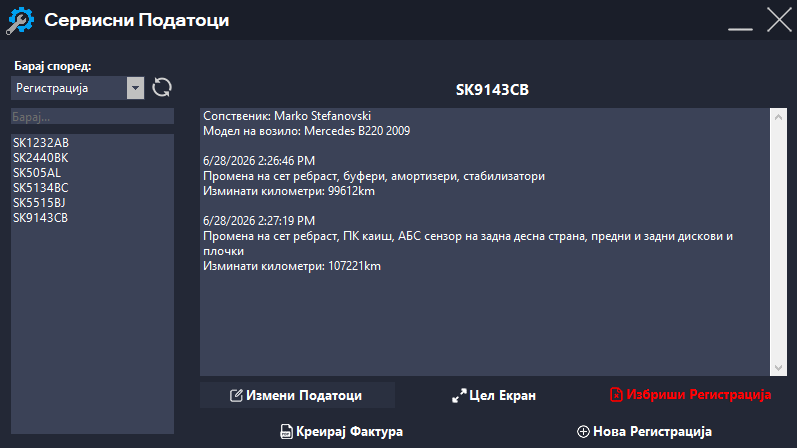
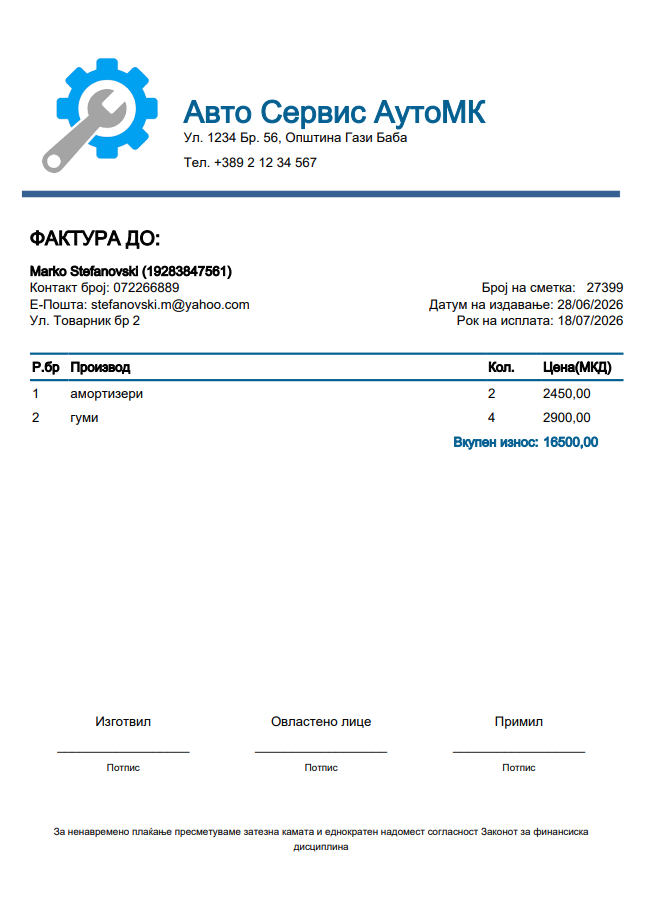

# VP-Project


# Апликација за евиденција на сервисирани автомобили


## Опис на апликацијата


Целта на оваа програма е да се олесни водењето евиденција на сервисирани автомобили, на наједноставен и најефикасен можен начин. Пишувањето на хартија се заменува со користење на тастатура, со што во голема мера се олеснува манипулирањето со податоци и корекцијата на грешки. Воедно, хаосот на работното место се заменува со удобен и прегледен кориснички интерфејс и дополнително се обезбедува подобрување на ефикасноста и заштеда на време.


## Упатство за користење


При стартување на апликацијата се извршува вчитување на сите претходно зачувани информации од JSON датотеките. Податоците се десеријализираат и се претвораат во објекти со кои програмата понатаму работи. Во датотеките се чуваат информации за возилата и сопствениците, по што тие се прикажуваат во соодветните листи на почетниот екран.


### Почетен екран


Почетниот екран претставува централното место од кое се пристапува до сите функции во програмата. Тој содржи:

* поле за пребарување според возило или сопственик
* листа на сите регистрирани возила
* листа на сите сопственици
* копче за додавање нова регистрација/сопственик
* копче за измена на податоци на регистрација/сопственик
* копче за приказ на цел екран
* копче за креирање фактура



### Пребарување на податоци

Апликацијата овозможува пребарување на два начина:

* според регистрација на возилото
* според име на сопственикот

При внесување на регистрација или име, програмата ги споредува внесените податоци со објектите кои се вчитани од JSON датотеките и прикажува само резултати кои одговараат на условот за пребарување.

Дополнително, со избор на сопственик се прикажуваат неговите податоци и сите возила кои се поврзани со него, што овозможува појасен преглед на клиенти со повеќе возила.

### Додавање ново возило

При избор на опцијата за нова регистрација се отвора форма за внесување на нови податоци

Корисникот внесува:

* регистрација
* име на сопственик
* модел на возилото
* број на изминати километри
* опис на извршениот сервис

Пред зачувување се врши проверка на задолжителните полиња. Доколку податоците се валидни, тие се додаваат во постоечката колекција на објекти, по што целата колекција повторно се серијализира во JSON датотека за трајно зачувување. Крајно интерфејсот автоматски се освежува. 

### Прикажување на податоци

Со избор на одредена регистрација од листата, програмата ги прикажува сите информации поврзани со избраното возило, кои се веќе вчитани од JSON датотеката во меморијата.

Корисникот може да ги види:

* регистрацијата
* сопственикот
* моделот
* километражата
* описот на сервисот
* датумот на сервисирање

Овој приказ овозможува брз увид во историјата на сервисирањето на секое возило.

### Создавање фактура

Функцијата за создавање фактури овозможува генерирање сметка за извршен сервис.

Корисникот избира:

* клиент
* рок за плаќање
* производ или услуга
* цена
* количина

При секоја промена на количината програмата автоматски ја пресметува вкупната цена без потреба од дополнително рачно пресметување.



По внесување на сите ставки, со притискање на копчето за креирање се генерира готова фактура која се зачувува во PDF формат и може веднаш да се испечати.

### Начин на работа на системот

Работниот процес на програмата може да се опише преку следните чекори:

1. Се стартува апликацијата и се вчитуваат JSON датотеките

2. Податоците се десеријализираат во објекти

3. Корисникот пребарува, додава, изменува или брише податоци

4. По секоја промена, колекцијата повторно се серијализира и се зачувува во JSON датотеката

5. Корисничкиот интерфејс автоматски се освежува со најновите информации

6. По потреба се креира фактура која се зачувува како PDF документ

На овој начин апликацијата обезбедува брзо, сигурно и организирано управување со податоците за сервисирани автомобили, намалувајќи ја можноста за човечки грешки и значително олеснувајќи ја секојдневната работа на сервисерите.

## Опис на кодот

### InfoText

Во InfoText класата се чуваат релевантни информации за автомобилот, односно промените кои му се извршени, точното време кога е направен запис за автомобилот и неговата километража.

```c#
[Serializable]
public class InfoText
{
    public string Text {  get; set; }
    public DateTime Datetime {  get; set; }
    public int Kilometers {  get; set; }
   
    public InfoText(string t, DateTime dt, int k)
    {
        Text = t;
        Datetime = dt;
        Kilometers = k;
    }
```

#### Класата InfoText

### Owner

Класата Owner ги содржи потребните податоци за сопственикот на возилото, како неговото име и презиме, e-mail адреса, ЕМБГ, телефонски број и адреса на живеење.

```c#
[Serializable]
public class Owner
{
    public string Name { get; set; }
    public string Email { get; set; }
    public string ID { get; set; }
    public string Number { get; set; }
    public string Address { get; set; }
    public Owner(string name, string email, string iD, string number, string address)
    {
        Name = name;
        Email = email;
        ID = iD;
        Number = number;
        Address = address;
    }
```

#### Класата Owner


### Registration

Во класата Registration се чуваат сите информации за автомобилот, како што се неговото име и модел, неговиот сопственик (објект од класата Owner) и информации за извршените промени во вид на листа од објекти од класата InfoText, со можност за додавање на дополнителен коментар преку методот AddComment.

```c#
[Serializable]
public class Registration
{
    public string Name { get; set; }
    public string CarModel { get; set; }
    public Owner Owner { get; set; }
    public List<InfoText> Info { get; set; }
    public Registration(string name, string carModel, Owner owner)
    {
        Name = name;
        CarModel = carModel;
        Owner = owner;
        Info = new List<InfoText>();
    }
```

#### Класата Registration

### UtilityClass

UtilityClass е статична класа која содржи листи и методи кои можат да се пристапат од било која форма и помагаат зачуваните податоци да се достапни постојано. Методите Serialize и Deserialize се користат за запишување, односно читање на податоците.

```c#
internal class UtilityClass
{
    public static List<Registration> Regs { get; set; } = new List<Registration>();
    public static List<Owner> Owners { get; set; } = new List<Owner>(); 
    public static string BaseFolderRegs { get; set; } = AppDomain.CurrentDomain.BaseDirectory + "/data/regs/";
    public static string BaseFolderOwners { get; set; } = AppDomain.CurrentDomain.BaseDirectory + "/data/owners/";
    public UtilityClass() { }
    
    public static T Deserialize<T>(string path)
    {
        T? obj;
        using (FileStream fs = File.OpenRead(path))
        {
            obj = JsonSerializer.Deserialize<T>(fs);
        }
        return obj;
    }
    public static bool Serialize<T>(T obj, string path)
    {
        string folder = string.Empty;
        if (obj.GetType() == typeof(Registration)) folder = BaseFolderRegs;
        else if (obj.GetType() == typeof(Owner)) folder = BaseFolderOwners;
        using (FileStream fs = File.Create(folder + path + ".json"))
        {
            JsonSerializer.Serialize(fs, obj);
        }
        if (File.Exists(folder + path + ".json")) return true;
        else return false;
    }
```

#### Класата UtilityClass, со методите Deserialize и Serialize


